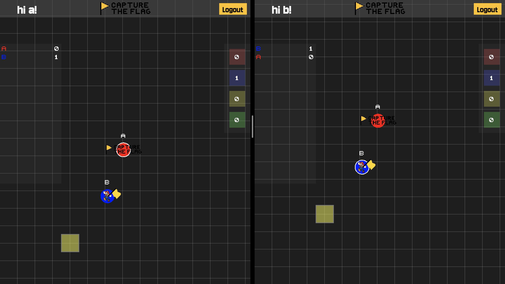

# [Capture the Flag](https://capture-the-flag.neemo.site)
This is an MMO Capture the Flag game. There are 4 teams (red, blue, green, yellow) and any number of players may join the game. A point is scored when a flag is stolen and succesfully taken to the player's home base. Individual as well as team scores are shown on the game page.

Deployed [here!](https://capture-the-flag.neemo.site)

## Controls/Rules
- Arrow keys to move, E/F to pass/kill.
- Can only pick up one flag at a time.
- Cannot kill other player while holding flag.

## Additional Features
- Teams
- Player Stats
- Achievements
- Leaderboard

## Run on Docker
Prerequisites: Docker

Steps:
1. Clone repo
2. Navigate to project directory
3. Run `docker compose up --build --force-recreate`

<!-- ## Logging -->
<!-- Logs are generated in the `logs` directory in the project root.  -->
